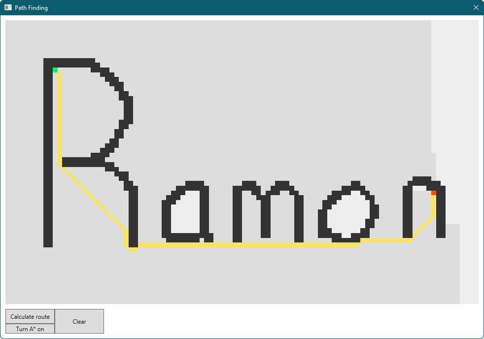
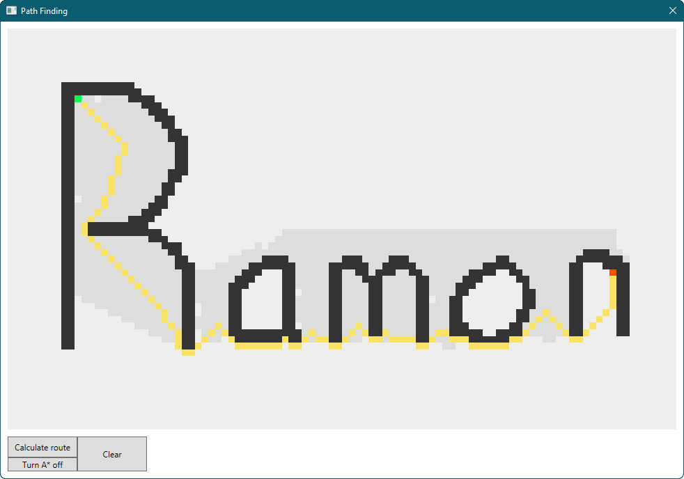

# Dijkstra 
Practicing coding.

## Details
https://en.wikipedia.org/wiki/Dijkstra%27s_algorithm

#### Shortest path calculation 
A user can draw walls/blocking pixels between two points.
When the user is done drawing, calculate the fastest route from  point to point.
- Start point = green coordinate
- End point = red coordinate
- Obstacles/Walls = black coordinates
- Calculated route = yellow coordinates
- Points involved in calculation (updated live) = dark gray coordinates
- Default color of points = light gray coordinates

#### Result 
The Dijksta algorithm takes a long time but will find the most direct route. 

  
Using a variation of Dijksta called A\* (A Star) will usually find a route considerably quicker but might not find the most direct route. A\* will prioritize calculating coordinates closer to the end point. This results in a path that "pulls" towards the end point. 

### ChangeLog
0.1.0 First working version 
